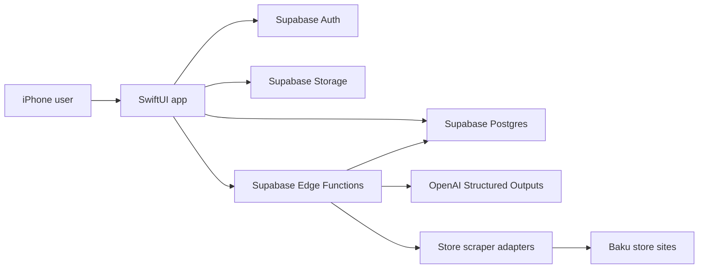
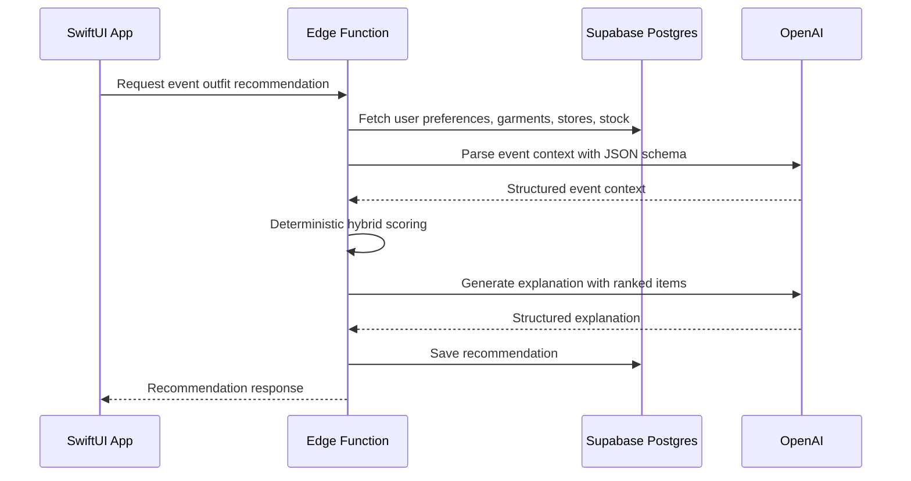
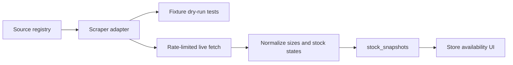

# Lunera Architecture

## System Shape
Lunera is a SwiftUI iOS app backed by Supabase. Supabase stores users, catalog data, stock snapshots, events, recommendations, and feedback. Supabase Edge Functions handle trusted operations such as OpenAI calls and inventory ingestion.

## App Layers
- `Lunera/App`: entry point, routing, tab shell, app-wide composition.
- `Lunera/Core`: design system, networking clients, shared models, utilities, persistence adapters.
- `Lunera/Features`: feature-owned views and view models for auth, home, preferences, events, recommendations, and inventory.
- `Lunera/Resources`: asset catalogs and preview assets.
- `Lunera/Supporting`: app configuration.

## Backend Services
- Auth: Supabase Auth for account identity.
- Postgres: canonical product, preference, event, stock, and recommendation data.
- Storage: garment images, event images, profile avatars, and source assets that need remote storage.
- Edge Functions: trusted AI and ingestion operations.
- Realtime: optional future updates for stock ingestion progress or recommendation status.

## AI Boundary
The iOS app never calls OpenAI directly. It calls Supabase Edge Functions with user/session context. Edge Functions call OpenAI using Structured Outputs so responses match a JSON schema and can be safely decoded.

AI responsibilities:
- Parse event descriptions into structured context.
- Generate concise, user-facing explanations.
- Optionally normalize fuzzy user preference language.

Non-AI responsibilities:
- Ranking recommendations.
- Enforcing stock rules.
- Enforcing authorization.
- Persisting app state.

## Recommendation Data Flow

## Inventory Data Flow

## Local Cache Strategy
Use Supabase as the source of truth. Use local persistence for responsive UI, recently viewed items, drafts, cached preferences, and offline-friendly display. SwiftData is acceptable for app-owned cache and drafts, but server sync logic should stay behind repositories so it can be tested and replaced.

## Security Defaults
- Enable RLS on all public schema tables.
- User-owned rows require `auth.uid()` ownership checks.
- Catalog rows can be readable by authenticated users.
- Service role operations are restricted to Edge Functions.
- Secrets live in Supabase secrets or local developer config, never in git.

